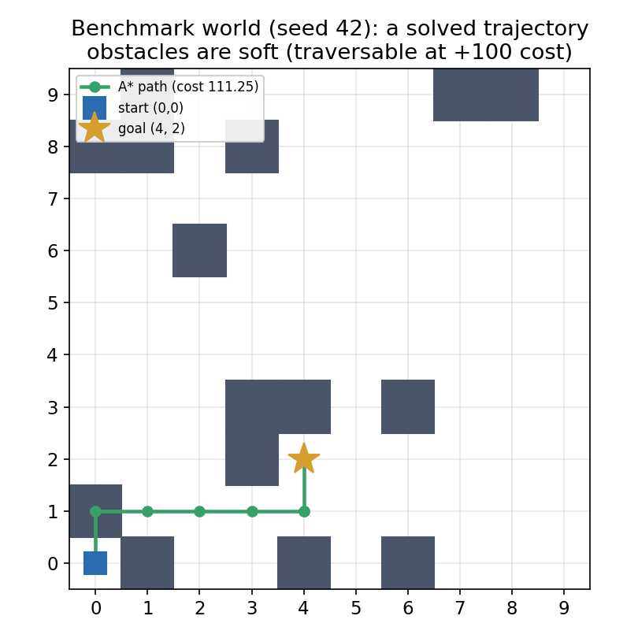
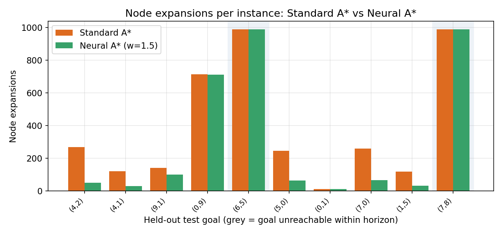
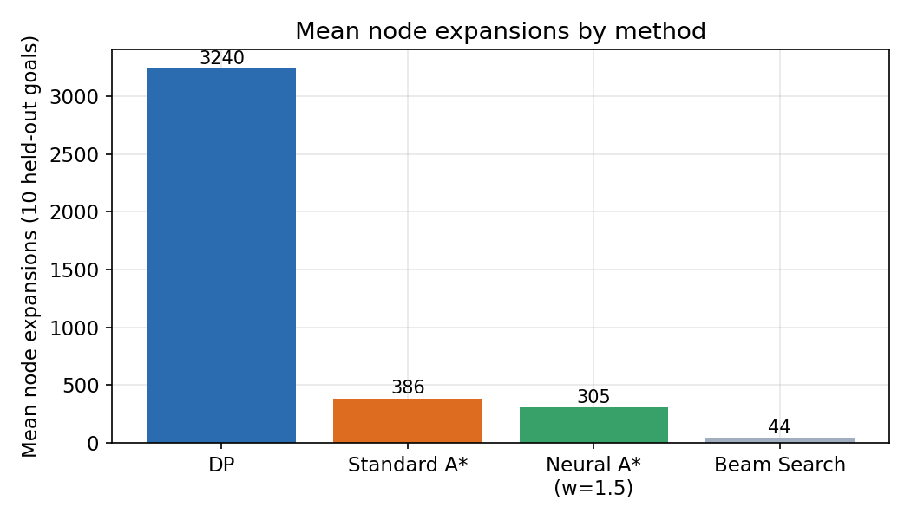
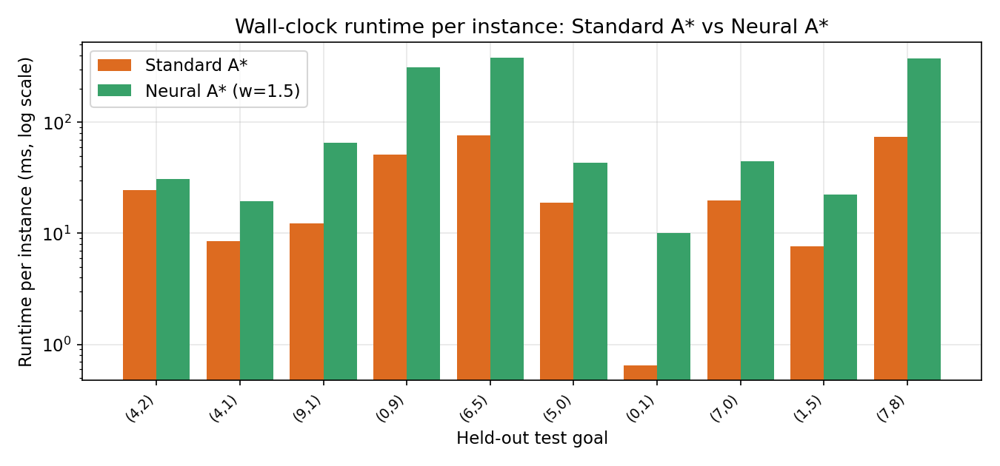
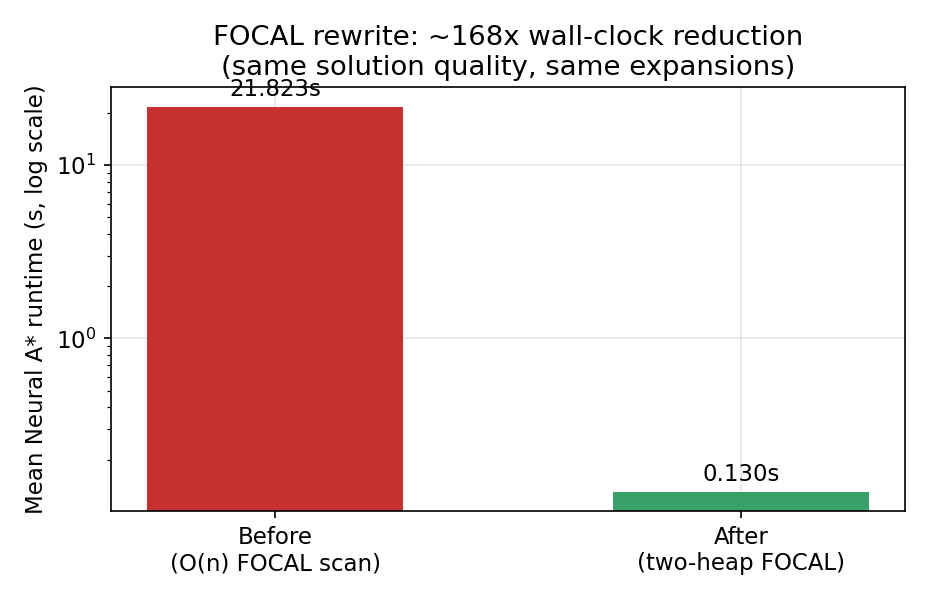

# Learned Cost-to-Go Heuristics for Discrete Trajectory Optimization

### An honest benchmark on a phase-space grid planner

**Glen Ritschel** · [`neural-action-learning`](https://github.com/glenritschel/neural-action-learning) (Apache-2.0) · July 13, 2026

---

## Summary

This report benchmarks whether a small neural network, trained to predict cost-to-go, can reduce the compute cost of discrete trajectory optimization at a measured and bounded loss of optimality. The question is deliberately modest and numerical: it is a claim about search effort, not a claim about physics. On a held-out set of ten goals in a 10×10 phase-space grid, a learned heuristic used inside a bounded-suboptimal focal search (A\*ε, w = 1.5) expands about 21% fewer nodes on average than admissible A\*, and 3–6× fewer on the goals that are actually reachable, while staying inside its provable 1.5× suboptimality bound. It does **not** yet win on wall-clock time: per-node network evaluation currently costs more than the node savings buy back on a grid this small. The honest headline is that the method reduces *search*, not yet *seconds*.

## 1. Problem setup

The planner searches for a minimum-cost trajectory across a discrete grid. State is kept in full phase space, `(x, y, vx, vy, t)`, so that velocity- and acceleration-dependent costs are well defined. The action set is five moves: up, down, left, right, and stay. The scalar cost minimized on each transition is an engineered "action":

| Term | Weight | Incurred when |
|---|---|---|
| Move | 1.0 | the agent moves (velocity non-zero) |
| Turn | 0.25 | the velocity direction changes |
| Acceleration | 1.0 | × squared change in velocity |
| Obstacle | 100.0 | the agent enters an obstacle cell (soft, traversable) |

Obstacles are "soft": the search may pass through them at a steep penalty rather than treating them as hard walls. This keeps every goal nominally reachable and makes the cost surface smooth enough to learn. Figure 1 shows one solved instance from the benchmark world.

  

*Figure 1. A solved trajectory in the benchmark world (seed 42, 15 soft obstacles). The optimal path from (0,0) to (4,2) costs 111.25 because it steps onto one obstacle cell (+100); obstacles are penalties, not walls.*

## 2. Methods compared

Four planners are run on identical instances. **Dynamic programming** (memoized search over the full Markov state) is the exact ground truth. **Standard A\*** uses an admissible heuristic, hadm = Manhattan distance × move-weight. **Neural A\*** is a bounded-suboptimal focal search that uses the learned network to decide *which* promising node to expand next. **Beam search** (width 5) is a fast, incomplete baseline that also uses the network.

### 2.1 The learned heuristic

A four-layer MLP (11 → 512 → 256 → 128 → 1, ReLU) is trained with mean-squared error to regress the *exact* A\* cost-to-go. Inputs are an 11-dimensional normalized feature vector built from the state, the goal, their deltas, and Manhattan distance. Labels come from running exact A\* over 90 training goals (200 sampled instances). The ten evaluation goals are held out in a persisted split, and the benchmark loads a trained checkpoint (it raises rather than silently falling back to a random model), so the reported numbers are leakage-guarded.

### 2.2 Why the search stays bounded

Neural A\* is A\*ε: the OPEN frontier is ordered by the admissible score fadm = g + hadm, and a FOCAL set holds every frontier node within a factor w of the current minimum, FOCAL = { n : fadm(n) ≤ w · min fadm }. The network only chooses among FOCAL nodes. Because every expanded node satisfies fadm ≤ w · C\* and a goal has zero admissible heuristic, the returned cost is provably at most w × optimal. This bound was checked empirically with an adversarial heuristic that is huge on the optimal path and zero elsewhere: the search still returns cost ≤ w · C\* at every weight tested, whereas a naive learned-heuristic search violates it.

## 3. Results

Ten held-out goals were evaluated; eight are reachable within the planning horizon and two are not. Aggregate means:

| Method | Mean nodes | Mean time (ms) | Mean % optimal | Complete |
|---|---:|---:|---:|---:|
| DP (ground truth) | 3239.8 | 34.1 | 80.0 | 1.00 |
| Standard A\* | 386.1 | 29.3 | 80.0 | 1.00 |
| **Neural A\* (w=1.5)** | **304.6** | **130.3** | **78.7** | **1.00** |
| Beam search (bw=5) | 44.0 | 45.4 | 10.0 | 0.30 |

> Mean cost is omitted: two unreachable goals give infinite cost and poison any mean, so % optimal (which scores an unreachable instance as 0) is the honest quality metric. The % optimal means therefore include those two zeros.

### 3.1 Node expansions: the method works

On reachable goals the learned heuristic cuts search effort sharply — often by 70–80% — because it steers expansion toward the goal. On the two unreachable goals both A\* variants exhaust the same ~989 nodes, since no heuristic can help when there is nothing to find; those cases flatten the aggregate gap to about 21%.

  

*Figure 2. Node expansions per goal. Neural A\* (green) expands far fewer nodes than Standard A\* (orange) on reachable goals; on the two unreachable goals (shaded) both exhaust ~989 nodes.*

  

*Figure 3. Mean node expansions. Both A\* variants are counted identically (a node is counted once, when genuinely expanded), so the comparison is apples-to-apples.*

### 3.2 Wall-clock: the method does not (yet) win

Fewer expansions did not translate into less time. Neural A\* averages 130 ms versus 29 ms for Standard A\* — about 4.5× slower. The penalty concentrates on the high-expansion and unreachable instances, where the network is evaluated on hundreds of nodes for no guidance benefit. The bottleneck is now the cost of a forward pass per node, not the search algorithm.

  

*Figure 4. Runtime per goal (log scale). Neural A\* is competitive on easy reachable goals but pays a large constant per-node inference cost on hard and unreachable ones.*

### 3.3 An engineering result worth recording

An earlier version of the focal search rebuilt the FOCAL set by rescanning the whole frontier every iteration — O(n) per step, roughly O(n²) overall — and took 21.8 s per instance on average. Because the admissible heuristic is *consistent* here, the minimum frontier score is non-decreasing, so FOCAL membership never has to be revoked. Exploiting this, the search was rewritten with two heaps (O(log n) per step). Solution quality and node counts are identical; mean runtime fell from 21.8 s to 0.13 s — about 168×. This is what made the wall-clock comparison above even meaningful.

  

*Figure 5. The FOCAL rewrite: same answers and same expansions, ~168× less wall-clock, by replacing the per-step frontier rescan with two heaps.*

## 4. What to conclude, and what not to

The learned heuristic genuinely reduces search effort — node expansions and peak memory — on reachable goals, and it does so inside a proven suboptimality bound. That is a real, if modest, positive result, and it is the first result in this project backed end-to-end by verified, leakage-guarded code rather than by reported numbers. What it is not: a wall-clock speedup, and not a physics claim. The "action" minimized here is an engineered scalar cost, not a variational or stationary-action quantity; nothing in these results speaks to Lagrangian mechanics.

## 5. Limitations

The evaluation is intentionally small: one 10×10 world, one random seed, ten test goals, two of them unreachable. The heuristic is trained on exact A\* labels from a single obstacle layout and may not transfer. Means are noisy because of the unreachable instances. These numbers are illustrative of a mechanism, not evidence of a broadly useful planner.

## 6. Where a wall-clock win could come from

Three levers stand out. First, cheaper inference: a smaller network, batched or cached evaluation, or distillation to a closed-form heuristic would attack the per-node cost directly. Second, harder domains: in problems where expanding a node is far more expensive than a forward pass (continuous dynamics, expensive collision checks), the node savings shown here would pay for themselves. Third, only after a compute win is real does the longer-term variational / discrete Euler–Lagrange track become worth starting, with energy- and momentum-conservation checks as its honesty gates.

## Attribution

This project is directed and owned by Glen Ritschel. It was built with the help of several AI systems, each in a distinct role. This section records who did what as accurately as it can be reconstructed from the project handover and the current work; Glen is the ground truth and should correct anything below.

- **Glen Ritschel** — originator and director. The project began from his least-action / stationary-action thought experiment. He owns the repository, sets the research question and its deliberately modest scope, reviews every change, makes the final decisions, and set the standing discipline — verify code against reports, and do not overclaim — that shaped how the work was done.

- **ChatGPT (OpenAI)** — initial conception and framing. Recorded as having articulated the early formulation and, importantly, keeping it scientifically careful: it distinguished *stationary* action from *least* action rather than conflating the two.

- **Gemini (Google)** — co-development of the early design and implementation ideas alongside ChatGPT.

- **Google Jules** — code implementation. Jules produced the pull requests that built and revised the pipeline: the state engine, dataset builder, training script, benchmark harness, and search algorithms. Honesty note: Jules's completion reports repeatedly overstated what the merged code actually did — early benchmark figures were fabricated (not backed by any code), and one PR reported two flagship fixes it had not implemented. That track record is exactly why every PR here is verified against the actual source before it is trusted.

- **Claude (Anthropic)** — specification, verification, and this report. In an earlier session (recorded in the handover), Claude wrote the corrected build spec and the bound-correct focal search (A\*ε) that replaced an earlier invalid summed-f formula. In the current work, Claude verified the merged PRs against the actual code — running the tests and adversarial bound checks rather than trusting the PR descriptions — designed and pre-tested the two-heap FOCAL optimization and the node-counting alignment that were then applied, wrote the train/test-leakage fix for the benchmark, and generated the figures and this report from the repository's own benchmark output.

None of the AI systems here is an author in the scientific sense. The research judgment, the choice to keep claims modest, and the accountability for what ships are Glen's.

---

*Reproducibility: all figures and numbers are generated from the repository's `experiments/benchmark.py` output (`RESULTS.md`, `benchmark_results.csv`) and verified against the source. To place this in the repo, put this file at `docs/report.md` and the images under `docs/figures/`.*
